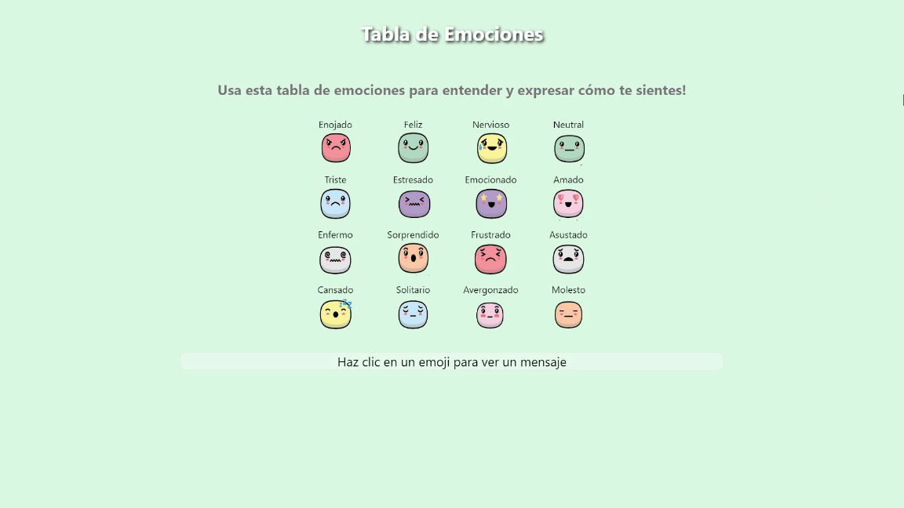

# Emoji Emotion Chart

Este proyecto es una tabla de emociones construida con React.js. La tabla utiliza 16 emojis diferentes para representar emociones, y al hacer clic en un emoji, aparece un mensaje reconfortante con consejos para manejar esa emoción.

## Demo



## Características

- Tabla interactiva con 16 emojis que representan diferentes emociones.
- Mensajes reconfortantes con consejos al hacer clic en cada emoji.
- Diseño atractivo y fácil de usar.

## Instalación

1. Clona el repositorio:
    ```bash
    git clone https://github.com/sushiii99/Emoji-Chart.git
    cd emoji-emotion-chart
    ```

2. Instala las dependencias:
    ```bash
    npm install
    ```

3. Ejecuta la aplicación:
    ```bash
    npm start
    ```

4. Abre [http://localhost:3000](http://localhost:3000) en tu navegador para ver la aplicación.

<hr>
<p align="center"><strong>English</strong></p>
<hr>


#Emoji Emotion Chart

This project is an emotion board built with React.js. The chart uses 16 different cute emojis to represent emotions, and when you click on an emoji, a comforting message appears with tips for managing that emotion.


## Characteristics

- Interactive table with 16 emojis that represent different emotions.
- Comforting messages with advice when you click each emoji.
- Attractive and easy-to-use design.

## Facility

1. Clone the repository:
    ```bash
    git clone https://github.com/sushiii99/Emoji-Chart.git
    cd emoji-emotion-chart
    ```

2. Install the dependencies:
    ```bash
    npm install
    ```

3. Run the application:
    ```bash
    npm start
    ```

4. Open [http://localhost:3000](http://localhost:3000) in your browser to view the application.
